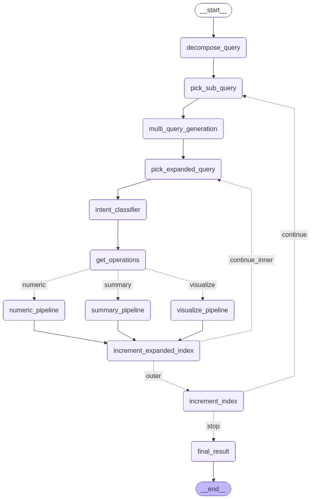

# Agentic Finance Manager

An AI-powered personal finance backend with an agentic chatbot built on FastAPI + LangGraph.

## Workflow Diagram



## Features

- User registration with password hashing
- Email verification using OTP
- JWT login (`/login`) and protected endpoints
- Current-user profile (`/users/me`)
- Update user profile (username, email, password)
- Resend email OTP
- Account deletion flow with OTP confirmation
- Create account with initial income transaction
- List all accounts for authenticated user
- Fetch account details
- Account summary endpoint (income, expense, net, recent transactions)
- Direct account balance endpoint
- Delete account with cascading transaction cleanup
- Create transaction (income/expense) with balance safety checks
- Get transaction by ID
- List transactions by account
- Update transaction with balance recalculation
- Delete transaction with balance rollback
- Agentic chatbot endpoint (`/chat/chat`)
- Query decomposition into sub-queries
- Intent routing (numeric, summary, visualize)
- Numeric analytics services (income, expense, spend, average spend, balance change)
- Category analytics (top category, category breakdown)
- Trend analytics (daily/weekly/monthly spending trends, monthly summary, period comparison)
- Visualization-focused data services (transaction type summary, category pie inputs)
- Streamlit API Lab UI for end-to-end testing
- In-app chat panels in Streamlit for account and transaction Q&A
- API request history + JSON log download from Streamlit

## Agentic Chatbot Flow

1. `decompose_query`
2. `pick_sub_query`
3. `intent_classifier`
4. `get_operations`
5. Route to one of:
6. `numeric_pipeline`
7. `summary_pipeline`
8. `visualize_pipeline`
9. `final_result`
10. `increment_index`
11. Continue loop or stop

## Tech Stack

- Python 3.12+
- FastAPI
- SQLAlchemy
- PostgreSQL (`psycopg2`)
- OAuth2 + JWT
- LangGraph / LangChain
- Uvicorn
- Streamlit

## Project Structure

```text
.
|-- main.py
|-- database.py
|-- models.py
|-- oauth2.py
|-- utils.py
|-- streamlit_app.py
|-- output.png
|-- routes/
|   |-- auth_routes.py
|   |-- user.py
|   |-- accounts_routes.py
|   |-- transactions_routes.py
|-- chatbot/
|   |-- graph.py
|   |-- state_manager.py
|   |-- nodes/
|   |-- services/
|-- schemas/
|-- frontend/
```

## Setup

1. Clone the repo:

```bash
git clone <your-repo-url>
cd Agentic_Graph
```

2. Create and activate a virtual environment:

```bash
python -m venv .venv
.venv\Scripts\activate
```

3. Install dependencies:

```bash
pip install -r requirements.txt
```

4. Configure PostgreSQL connection (currently set in `database.py`).

5. Run API server:

```bash
uvicorn main:app --reload
```

6. Run Streamlit frontend:

```bash
streamlit run streamlit_app.py
```

## API Docs

- Swagger UI: `http://127.0.0.1:8000/docs`
- ReDoc: `http://127.0.0.1:8000/redoc`

## Notes

- CORS is enabled for all origins in current setup.
- `database.py` currently uses a hardcoded PostgreSQL URL; moving it to environment variables is recommended for production.
